# MirrorMinds Class Diagram

## System Architecture Overview

This class diagram represents the MirrorMinds AI-Powered Ethical Debate Simulator, showing the key components and their relationships across the backend API and frontend application.

```mermaid
classDiagram
    %% Backend Models
    class Dilemma {
        +string title
        +string A
        +string B
        +string constraints
    }

    class AgentTurn {
        +string agent
        +string stance
        +string argument
    }

    class Transcript {
        +Dilemma dilemma
        +List~AgentTurn~ turns
    }

    class Verdict {
        +dict scores
        +string final_recommendation
        +int confidence
        +string verdict
    }

    %% Custom Agent Models
    class CustomAgent {
        +string id
        +string name
        +string avatar
        +string description
        +string enhanced_prompt
        +string system_prompt
        +string created_by
        +datetime created_at
        +bool is_public
        +int usage_count
        +float average_rating
        +int rating_count
    }

    class AgentRating {
        +string id
        +string agent_id
        +string debate_id
        +string user_id
        +int argument_quality
        +int consistency
        +int engagement
        +int overall_satisfaction
        +string comment
        +datetime created_at
    }

    class EnhancementRequest {
        +string original_description
        +string enhanced_prompt
        +List~string~ improvements_made
        +Dict~string,float~ analysis_scores
        +List~string~ suggestions
    }

    class AgentCreationRequest {
        +string name
        +string avatar
        +string description
    }

    %% Backend Services
    class FastAPIApp {
        +CORSMiddleware middleware
        +post_openings(dilemma: Dilemma)
        +post_agent(agent_name: string, dilemma: Dilemma)
        +post_continue(transcript: Transcript)
        +post_judge(transcript: Transcript)
        +post_create_agent(request: AgentCreationRequest)
        +get_agents(public_only: bool, search: string)
        +post_enhance(description: string)
        +put_agent(agent_id: string, request: AgentUpdateRequest)
        +delete_agent(agent_id: string)
    }

    class AgentService {
        -string storage_path
        +create_agent(request: AgentCreationRequest, enhanced_prompt: string, system_prompt: string) CustomAgent
        +get_agent(agent_id: string) CustomAgent
        +list_agents(public_only: bool, search: string, limit: int) List~CustomAgent~
        +update_agent(agent_id: string, request: AgentUpdateRequest) CustomAgent
        +delete_agent(agent_id: string) bool
        +increment_usage(agent_id: string)
        +add_rating(rating: AgentRating)
        +get_all_available_agents() List~Dict~
    }

    class EnhancementService {
        -PromptAnalyzer analyzer
        -PromptEnhancer enhancer
        +enhance_agent_description(description: string) EnhancementRequest
        +analyze_only(description: string) Dict
        +generate_system_prompt(enhanced_prompt: string, agent_name: string) string
    }

    class PromptAnalyzer {
        +analyze_description(description: string) Dict~string,float~
        +generate_suggestions(description: string, scores: Dict) List~string~
        -score_clarity(description: string) float
        -score_completeness(description: string) float
        -score_specificity(description: string) float
        -score_consistency(description: string) float
    }

    class PromptEnhancer {
        +string ENHANCER_SYSTEM_PROMPT
        +enhance_description(description: string) EnhancementRequest
        -identify_improvements(original: string, enhanced: string) List~string~
        -fallback_enhancement(description: string, scores: Dict, suggestions: List) EnhancementRequest
    }

    class OllamaService {
        -string MODEL
        -string OLLAMA_API
        -string OLLAMA_API_KEY
        +call_ollama(system_prompt: string, user_prompt: string) string
    }

    class JSONParser {
        +clamp_json(response: string, fallback: dict) dict
    }

    %% AI Agents
    class EthicalAgent {
        <<abstract>>
        +string name
        +string system_prompt
        +generate_opening(dilemma: Dilemma) AgentTurn
        +generate_response(transcript: Transcript) AgentTurn
    }

    class DeontologistAgent {
        +string name = "Deon"
        +string system_prompt = DEON_SYS
        +generate_opening(dilemma: Dilemma) AgentTurn
        +generate_response(transcript: Transcript) AgentTurn
    }

    class ConsequentialistAgent {
        +string name = "Conse"
        +string system_prompt = CONSE_SYS
        +generate_opening(dilemma: Dilemma) AgentTurn
        +generate_response(transcript: Transcript) AgentTurn
    }

    class VirtueEthicistAgent {
        +string name = "Virtue"
        +string system_prompt = VIRTUE_SYS
        +generate_opening(dilemma: Dilemma) AgentTurn
        +generate_response(transcript: Transcript) AgentTurn
    }

    class JudgeAgent {
        +string name = "Judge"
        +string system_prompt = JUDGE_SYS
        +evaluate_debate(transcript: Transcript) Verdict
    }

    %% Frontend Components
    class App {
        -string stage
        -Dilemma dilemma
        -Transcript transcript
        -Verdict verdict
        -int roundCount
        -string currentThinkingAgent
        -Array debateHistory
        +handleStartDebate(dilemmaData: object)
        +handleContinue()
        +handleJudge()
        +handleReset()
        +openAgentBuilder()
        +closeAgentBuilder()
    }

    class DilemmaForm {
        +onSubmit: function
        +render() JSX
        +handleSubmit(formData: object)
    }

    class DebateView {
        +transcript: Transcript
        +roundCount: number
        +currentThinkingAgent: string
        +onContinue: function
        +onJudge: function
        +render() JSX
    }

    class VerdictView {
        +verdict: Verdict
        +onReset: function
        +render() JSX
    }

    class Sidebar {
        +stage: string
        +debateHistory: Array
        +customAgents: Array
        +onNewDebate: function
        +onViewHistory: function
        +onOpenAgentBuilder: function
        +render() JSX
    }

    class AgentCard {
        +agent: string
        +turn: AgentTurn
        +isThinking: boolean
        +render() JSX
    }

    %% Agent Builder Components
    class AgentBuilderScreen {
        -int currentStep
        -object formData
        -EnhancementRequest enhancement
        -bool isProcessing
        -object errors
        +onClose: function
        +onAgentCreated: function
        +handleInputChange(field: string, value: string)
        +validateStep(step: int) bool
        +nextStep()
        +prevStep()
        +enhanceDescription()
        +createAgent(useEnhanced: bool)
        +render() JSX
    }

    class AgentBuilderForm {
        +onAgentCreated: function
        +onClose: function
        -object formData
        -bool isAnalyzing
        -EnhancementRequest enhancement
        -object errors
        +handleInputChange(field: string, value: string)
        +validateForm() bool
        +handleAnalyze()
        +handleCreateAgent(useEnhanced: bool)
        +render() JSX
    }

    %% API Service
    class APIService {
        -string API_URL
        +startDebate(dilemma: Dilemma) Promise~Array~
        +continueDebate(transcript: Transcript) Promise~Array~
        +judgeDebate(transcript: Transcript) Promise~Verdict~
    }

    %% Relationships
    FastAPIApp --> OllamaService : uses
    FastAPIApp --> JSONParser : uses
    FastAPIApp --> AgentService : uses
    FastAPIApp --> EnhancementService : uses
    FastAPIApp --> Dilemma : processes
    FastAPIApp --> Transcript : processes
    FastAPIApp --> AgentTurn : returns
    FastAPIApp --> Verdict : returns
    FastAPIApp --> CustomAgent : manages
    FastAPIApp --> EnhancementRequest : returns

    AgentService --> CustomAgent : creates/manages
    AgentService --> AgentRating : stores
    AgentService --> AgentCreationRequest : processes

    EnhancementService --> PromptAnalyzer : uses
    EnhancementService --> PromptEnhancer : uses
    EnhancementService --> EnhancementRequest : creates

    PromptEnhancer --> OllamaService : uses
    PromptAnalyzer --> EnhancementRequest : analyzes

    EthicalAgent <|-- DeontologistAgent : implements
    EthicalAgent <|-- ConsequentialistAgent : implements
    EthicalAgent <|-- VirtueEthicistAgent : implements
    EthicalAgent <|-- JudgeAgent : implements

    EthicalAgent --> OllamaService : uses
    EthicalAgent --> JSONParser : uses

    Transcript --> Dilemma : contains
    Transcript --> AgentTurn : contains

    App --> DilemmaForm : renders
    App --> DebateView : renders
    App --> VerdictView : renders
    App --> Sidebar : renders
    App --> AgentBuilderScreen : renders
    App --> APIService : uses

    DebateView --> AgentCard : renders
    Sidebar --> AgentBuilderForm : contains
    
    AgentBuilderScreen --> EnhancementRequest : displays
    AgentBuilderForm --> EnhancementRequest : displays
    
    APIService --> FastAPIApp : calls

    %% Data Flow
    DilemmaForm --> App : submits dilemma
    App --> APIService : requests debate
    APIService --> FastAPIApp : HTTP requests
    FastAPIApp --> EthicalAgent : generates responses
    EthicalAgent --> OllamaService : AI inference
    OllamaService --> JSONParser : parses response

    %% Agent Builder Flow
    AgentBuilderScreen --> APIService : creates agents
    APIService --> AgentService : agent CRUD
    AgentService --> EnhancementService : enhances descriptions
    EnhancementService --> CustomAgent : creates enhanced agents
```

## Component Descriptions

### Backend Components

#### **Core Models (Pydantic)**
- **Dilemma**: Represents an ethical scenario with two options and constraints
- **AgentTurn**: Captures an agent's stance and argument in the debate
- **Transcript**: Complete record of a debate session
- **Verdict**: Final judgment with scores and recommendation

#### **Custom Agent Models**
- **CustomAgent**: User-created ethical agents with enhanced prompts and metadata
- **AgentRating**: Community feedback and performance metrics for agents
- **EnhancementRequest**: AI analysis and improvement results for agent descriptions
- **AgentCreationRequest**: Input model for creating new custom agents

#### **Services**
- **FastAPIApp**: Main application with REST endpoints for debate and agent management
- **AgentService**: CRUD operations and management for custom agents with JSON storage
- **EnhancementService**: AI-powered analysis and improvement of agent descriptions
- **PromptAnalyzer**: Quality scoring system for agent descriptions (clarity, completeness, etc.)
- **PromptEnhancer**: AI-powered enhancement using Ollama integration with fallback mechanisms
- **OllamaService**: Handles AI model communication (local/cloud Ollama)
- **JSONParser**: Robust parsing of AI responses with fallback strategies

#### **AI Agents**
- **EthicalAgent**: Abstract base class defining agent interface
- **DeontologistAgent**: Rule-based ethical reasoning (duties, rights)
- **ConsequentialistAgent**: Outcome-based ethical reasoning (utility, welfare)
- **VirtueEthicistAgent**: Character-based ethical reasoning (virtues, flourishing)
- **JudgeAgent**: Neutral evaluator providing final verdict

### Frontend Components

#### **Main Application**
- **App**: Root component managing application state and navigation
- **APIService**: Handles HTTP communication with backend

#### **UI Components**
- **DilemmaForm**: Input form for creating ethical scenarios
- **DebateView**: Real-time display of agent arguments and responses
- **VerdictView**: Final judgment display with scores and recommendation
- **Sidebar**: Navigation, debate history, and agent library management
- **AgentCard**: Individual agent display with thinking states

#### **Agent Builder Components**
- **AgentBuilderScreen**: Full-screen, 4-step wizard for creating custom agents
- **AgentBuilderForm**: Compact agent creation form (legacy, used in sidebar)
- **Enhancement Panel**: AI analysis results with before/after comparison
- **Agent Preview**: Final agent preview with quality metrics before creation

## Key Design Patterns

### **Strategy Pattern**
Each ethical agent implements the same interface but with different reasoning strategies (deontological, consequentialist, virtue ethics).

### **Observer Pattern**
Frontend components observe state changes and update UI accordingly (thinking states, new arguments).

### **Factory Pattern**
Agent creation and management through the FastAPI endpoints and AgentService.

### **Builder Pattern**
AgentBuilderScreen implements a step-by-step construction process for complex agent creation.

### **Service Layer Pattern**
Clear separation between API endpoints (controllers) and business logic (services).

### **Model-View-Controller (MVC)**
- **Model**: Pydantic models and data structures
- **View**: React components for UI rendering
- **Controller**: FastAPI endpoints and React event handlers

## Technology Stack

- **Backend**: Python, FastAPI, Pydantic, Ollama
- **Frontend**: React, Vite, Modern JavaScript
- **AI**: Local/Cloud Ollama models (Qwen 2.5 7B)
- **Communication**: REST API with JSON payloads

## Scalability Considerations

The modular design allows for:
- **New Agent Types**: Easy addition through EthicalAgent interface or CustomAgent creation
- **Multiple AI Providers**: OllamaService can be extended or replaced
- **Enhanced UI**: Component-based architecture supports feature expansion
- **Cloud Deployment**: Environment-aware configuration for local/cloud AI
- **Database Migration**: AgentService abstracts storage, easy to migrate from JSON to database
- **Community Features**: Rating and discovery systems ready for social features
- **Advanced Analytics**: Agent performance tracking foundation in place
